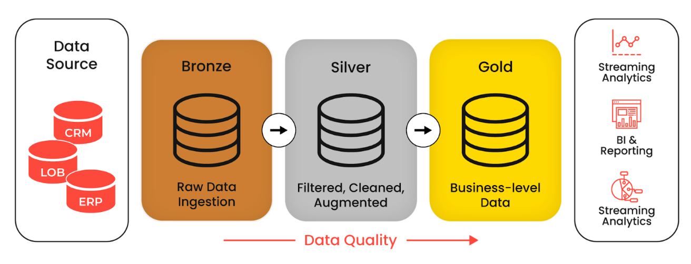

# Real-Time Notification Event Analytics Architecture

## 1. Executive Summary

This document proposes an event-driven analytics architecture for an existing distributed notification platform.

The platform already builds and sends notifications by combining data from multiple services (user information, permissions, notification preferences, templates, tenant configuration, provider configuration, and other domain services). What it lacks is a centralized notification history capable of answering:

- Which notifications were generated for a specific user?
- Was a notification successfully queued? Did delivery fail?
- How many delivery attempts occurred?
- Was the failure caused by the provider, networking, permissions, or the internal queue?
- How long did each stage take?
- Which notifications are currently stuck?
- What is the failure rate for a specific channel or provider?

The proposal introduces a **separate event analytics plane** — it does not require redesigning the existing notification execution flow.

```text
Existing Services
       |  standardized notification events
       v
Event Ingestion Layer
       v
S3 Bronze — raw immutable events
       |  object-created trigger
       v
Silver Normalization -> S3 Silver — canonical Parquet/Iceberg
       v
Gold / OLAP (initially ClickHouse)
       |
       +-- Notification History API
       +-- Operational Dashboard
       +-- Failure Analytics / Delivery Metrics / User-level Tracking
```

## 2. Problem Statement

The simplified notification flow is:

```text
User / Permissions / Preferences / Templates
                  v
         Notification Builder
                  v
        Notification Dispatcher
                  v
               SQS FIFO
                  v
          Delivery Worker
                  v
          External Provider
```

Each component knows only part of the lifecycle. The goal is to reconstruct the complete notification history **without** introducing a new transactional notification database and **without** coupling delivery to the analytics infrastructure.

## 3. Architectural Goals

The Medallion architecture is used to preserve raw historical evidence, establish a canonical analytical record, and support query-optimized views — all without coupling notification processing to a new centralized database.

A hard constraint: no database may be introduced into the notification path as an outbox. Applications emit events directly; they do not store, coordinate, or forward them through a separate notification database. This avoids an extra transactional dependency and keeps the existing flow independent from the analytics platform.



**3.1 Minimal impact.** Applications only emit events. They have no direct dependency on ClickHouse, Kafka, or a centralized notification database.

**3.2 Complete lifecycle tracking.** The platform reconstructs the lifecycle from events such as `notification.requested`, `notification.validation.succeeded`, `notification.build.succeeded`, `notification.enqueue.started`, `notification.enqueued`, `notification.enqueue.failed`, `notification.delivery.started`, `notification.delivery.succeeded`, `notification.delivery.failed`, `notification.retry.scheduled`. This enables tracking individual notifications, failures, retries, and incomplete operations.

**3.3 Permanent and auditable history.** Raw events are retained in S3 (the **Bronze layer**), independently from the analytical database, for auditing and historical investigation, legal/compliance/dispute evidence, reprocessing and debugging, schema evolution, and rebuilding analytical datasets.

**3.4 Canonical analytical data.** Services and event versions produce slightly different payloads. The **Silver layer** validates, deduplicates, and normalizes them into a stable canonical schema in an open format (Parquet/Iceberg), separating data interpretation from the analytical engine.

**3.5 Near-real-time OLAP.** The **Gold layer** provides query-optimized representations for notification history, failures, delivery metrics, and dashboards. ClickHouse is the initial engine because it suits high-volume event analytics and near-real-time aggregation.

**3.6 OLAP engine independence.** Bronze and Silver do not know which analytical database is used. The dependency direction is:

```text
                    SILVER (canonical data)
                            |
        +-------------------+-------------------+
        v                   v                   v
   ClickHouse             Pinot               Druid
```

and never `Application -> ClickHouse-specific event`. Because Silver is stored in an open canonical format, ClickHouse can later be replaced by Pinot, Druid, BigQuery, Snowflake, or another engine without changing event producers or losing history — only the Gold ingestion and query layer changes. In short:

```text
Bronze = historical truth
Silver = canonical analytical truth
Gold   = query-optimized projection
```

## 4. High-Level Architecture

```text
                    EXISTING NOTIFICATION PLATFORM

 User / Permission / Preference / Template / Tenant / Other Services
                        |
                        v
                Notification Builder
                        v
               Notification Dispatcher
                        v
                 Existing SQS FIFO
                        v
                  Delivery Worker
                        |
              +---------+---------+
              v                   v
           Webhook            Email / SMS


                     EVENT ANALYTICS PLATFORM

 Existing Services
        |  Event SDK / HTTP
        v
+-----------------------------+
| Event Ingestion Layer       |
+-------------+---------------+
              |  durable raw write
              v
+-----------------------------+
| BRONZE — Amazon S3          |
| Raw immutable events        |
+-------------+---------------+
              |  S3 ObjectCreated
              v
+-----------------------------+
| Silver Normalizer           |
| Validation / Normalization  |
| Deduplication (Lambda)      |
+-------------+---------------+
              v
+-----------------------------+
| SILVER — Amazon S3          |
| Parquet / Iceberg           |
| Canonical event model       |
+-------------+---------------+
              v
+-----------------------------+
| GOLD — OLAP Engine          |
| Initially ClickHouse        |
+-------------+---------------+
              |
       +------+-------+------------------+
       v              v                  v
 Notification    Operational      Failure / SLA
   History        Dashboard         Analytics
```

## 5. Transport Decisions

### 5.1 Why Kafka is not used initially

Kafka is a valid technology here — it provides durable event streams, consumer groups, replay, partition ordering, high throughput, and multiple independent consumers. It is simply not required to solve the current problem, because the architecture already has a durable component: **S3 Bronze**. Once an event exists in Bronze it is permanently available for reprocessing, replay, normalization, migration, and analytics rebuilding.

Kafka would therefore add a layer between the application and permanent storage (`Application -> Kafka -> Bronze` instead of `Application -> Bronze`) without enough initial value to justify the operational complexity.

**This is not an anti-Kafka decision.** The architecture intentionally allows a broker to be introduced later — for example, at very high ingestion volume:

```text
Event Ingestion
      v
Kafka / Redpanda
      +------> Bronze Writer
      +------> ClickHouse Real-Time Consumer
      +------> Other Consumers
```

Kafka becomes justified with very high sustained throughput, many independent real-time consumers, complex streaming transformations, explicit consumer offsets, replay from the transport layer, strong partition-based ordering, extensive backpressure control, or sub-second analytical latency. The rule is: **do not introduce Kafka until it solves a concrete scaling or streaming problem.** The event contract and Medallion layers remain unchanged if it is added later.

### 5.2 Why there is no SQS between Bronze and Silver initially

S3 already provides object-created notifications, so `Bronze -> SQS -> Silver Processor` can be simplified to:

```text
s3:ObjectCreated
  prefix: bronze/notification-events/
  target: SilverNormalizer Lambda
```

This removes an unnecessary transport layer. SQS can be introduced later if the pipeline needs explicit backpressure, buffering of large bursts, controlled worker concurrency, independent retry behavior, dead-letter queues, or processing-rate isolation — evolving to `S3 -> EventBridge -> SQS -> Silver Workers` without changing producers or Bronze.

## 6. Bronze Layer

Bronze answers: **what exactly did the source system emit?** It contains the original event with minimal processing: immutable, append-only, schema tolerant, replayable, historically complete. It must not contain business aggregations, and it must not try to determine the current status of a notification.

### 6.1 Example Bronze event

A failed webhook delivery (timeout) for notification `ntf_01K4N61P9J7CGJQXD09WQPMBA2`, user `usr_802941`:

```json
{
  "event_id": "evt_01K4N6A6BXHQE1D83VN8T5BMV9",
  "event_type": "notification.delivery.failed",
  "event_version": 1,
  "occurred_at": "2026-09-08T19:22:14.281Z",

  "source": {
    "service": "webhook-dispatcher",
    "instance": "worker-17",
    "environment": "production",
    "region": "sa-east-1"
  },

  "context": {
    "tenant_id": "ten_49201",
    "user_id": "usr_802941",
    "notification_id": "ntf_01K4N61P9J7CGJQXD09WQPMBA2",
    "delivery_id": "dlv_01K4N68JP7HBNT6PN74JTBX5Z1",
    "attempt_id": "att_01K4N6A2FT15MWKWAMHFDPPEEX",
    "operation_id": "op_01K4N69ZYN8NW3EDP6PD1RJXTF",
    "correlation_id": "cor_01K4N61P8KB9Q7HFQYJ5WS9GKT",
    "causation_id": "evt_01K4N682FDQEPH8E0D18KCDW6F"
  },

  "data": {
    "channel": "webhook",
    "destination": { "type": "http", "endpoint_id": "endpoint_38201" },
    "attempt": 2,
    "duration_ms": 30005,
    "result": { "status": "failed" },
    "response": { "http_status": null },
    "error": {
      "category": "network",
      "code": "UPSTREAM_TIMEOUT",
      "message": "Request timed out after 30 seconds",
      "retryable": true
    },
    "retry": {
      "scheduled": true,
      "next_attempt_at": "2026-09-08T19:23:14.281Z"
    }
  }
}
```

### 6.2 Ingestion metadata

The lake adds ingestion metadata without modifying the original event:

```json
{
  "ingestion": {
    "received_at": "2026-09-08T19:22:14.430Z",
    "bronze_schema_version": 1,
    "region": "sa-east-1",
    "source": "notification-event-ingestion"
  },
  "event": { "...": "original event" }
}
```

`event.occurred_at` is when the business event occurred; `ingestion.received_at` is when the analytics platform received it. The distinction enables measuring ingestion lag.

### 6.3 Storage layout

```text
s3://notification-analytics/
  bronze/
    notification-events/
      year=2026/month=09/day=08/hour=19/
        events-000001.json.gz
        events-000002.json.gz
```

The ingestion layer should batch multiple events into a single object (e.g. 500–1000 events or 5–10 MB, depending on throughput and latency requirements). One event per S3 object must be avoided — it creates a severe small-file problem.

## 7. Silver Layer

Silver answers: **what does this event mean according to our canonical notification event model?** Bronze preserves the source representation; Silver creates a standardized one.

### 7.1 Why Silver exists

An older service might emit `{"event_type": "delivery.failed", "error": "timeout"}` while a newer one emits `{"event_type": "notification.delivery.failed", "error": {"category": "network", "code": "UPSTREAM_TIMEOUT", "retryable": true}}`. Bronze preserves both formats; Silver converts both into:

```text
event_type      = notification.delivery.failed
lifecycle_stage = DELIVERY
status          = FAILED
error_category  = NETWORK
error_code      = UPSTREAM_TIMEOUT
error_retryable = true
```

Consumers therefore never need to understand every historical event version.

### 7.2 Responsibilities

Schema and required-field validation; event ID validation; event-version interpretation; timestamp normalization; nested field extraction; event-type and error-code normalization; deduplication; PII filtering or masking; malformed-event quarantine; data type conversion; source lineage preservation.

### 7.3 Canonical schema — `notification_events`

| Group | Fields |
| ----- | ------ |
| Identity | `event_id`, `notification_id`, `tenant_id`, `user_id`, `delivery_id`, `attempt_id`, `operation_id`, `correlation_id`, `causation_id` |
| Event | `event_type`, `event_version`, `lifecycle_stage`, `status`, `occurred_at`, `ingested_at` |
| Source | `source_service`, `source_instance`, `environment`, `region` |
| Delivery | `channel`, `provider`, `destination_type`, `attempt_number`, `duration_ms`, `http_status` |
| Failure | `error_category`, `error_code`, `error_retryable` |
| Lineage | `bronze_object_path`, `bronze_schema_version`, `silver_schema_version` |

Many fields are nullable — `notification.validation.started`, for example, has no `http_status` or `attempt_number`.

### 7.4 Example Silver record

The Bronze event above becomes approximately:

| Field             | Value                          |
| ----------------- | ------------------------------ |
| `event_id`        | `evt_01K4N6A6BX...`            |
| `notification_id` | `ntf_01K4N61P...`              |
| `tenant_id`       | `ten_49201`                    |
| `user_id`         | `usr_802941`                   |
| `delivery_id`     | `dlv_01K4N68...`               |
| `attempt_id`      | `att_01K4N6A...`               |
| `event_type`      | `notification.delivery.failed` |
| `lifecycle_stage` | `DELIVERY`                     |
| `status`          | `FAILED`                       |
| `channel`         | `WEBHOOK`                      |
| `attempt_number`  | `2`                            |
| `duration_ms`     | `30005`                        |
| `error_category`  | `NETWORK`                      |
| `error_code`      | `UPSTREAM_TIMEOUT`             |
| `error_retryable` | `true`                         |
| `source_service`  | `webhook-dispatcher`           |
| `region`          | `sa-east-1`                    |
| `occurred_at`     | `2026-09-08 19:22:14.281`      |

### 7.5 Physical format

The recommended starting point is **S3 + Parquet**. If table-level capabilities are needed, **Apache Iceberg** over Parquet adds schema evolution, snapshots, table metadata, partition evolution, and analytical-engine interoperability. Most importantly, the canonical dataset remains independent from ClickHouse.

## 8. Gold Layer

Gold answers: **what does the product need to know?** The initial engine is **ClickHouse**, selected because the workload is naturally OLAP-oriented: append-heavy event history, large volumes, aggregation-heavy queries, time-series analysis, user-level history, latency percentiles, error rates, and operational dashboards.

### 8.1 A projection, not the source of truth

ClickHouse is a serving and analytical projection, not the only historical copy of the events. If a table is lost or a transformation changes, Gold is recreated from `S3 Silver -> reload -> ClickHouse`. Rebuilding is a routine operation:

```text
DROP ClickHouse tables -> recreate schema -> load Silver -> rebuild materialized projections
```

The same mechanism supports migrating to a different analytical engine without replaying production notification traffic — which significantly reduces analytical database lock-in.

### 8.2 Example Gold tables

| Table | Content |
| ----- | ------- |
| `notification_events` | Normalized event history |
| `notification_current_state` | Current status per notification |
| `notification_attempts` | `notification_id`, `attempt_id`, `attempt_number`, `started_at`, `finished_at`, `result`, `duration_ms`, `error_code` |
| `notification_errors` | `tenant_id`, `channel`, `provider`, `error_category`, `error_code`, `event_count`, `first_seen`, `last_seen` |
| `notification_metrics_1m` / `_1h` | `window_start`, `tenant_id`, `channel`, `requested`, `delivered`, `failed`, `retried`, `success_rate`, `p50/p95/p99_latency_ms` |

Example `notification_current_state` row:

```text
notification_id:       ntf_01K4N61P9J7CGJQXD09WQPMBA2
user_id:               usr_802941
channel:               WEBHOOK
status:                DELIVERED
attempt_count:         2
last_error_code:       UPSTREAM_TIMEOUT
recovered_after_retry: true
created_at:            2026-09-08 19:22:01
updated_at:            2026-09-08 19:23:15
```

ClickHouse Materialized Views can maintain many of these projections incrementally.

## 9. Event Design

### 9.1 Correlation instead of global sequencing

In a distributed platform, a producer should not have to obtain a global sequential counter from a centralized coordinator before emitting an event. Correlation is carried in the event itself through `event_id`, `notification_id`, `operation_id`, `attempt_id`, `correlation_id`, and `causation_id`:

```text
evt_A  notification.enqueue.started  operation_id = op_123
   v
evt_B  notification.enqueue.failed   operation_id = op_123, causation_id = evt_A
```

This preserves causal relationships without distributed sequencing coordination.

### 9.2 Started/terminal event pattern

Important operations — validation, build, enqueue, delivery, provider callback processing — should emit a start event and a terminal event (`notification.enqueue.started` followed by `notification.enqueued` or `notification.enqueue.failed`).

This doubles as a failure-detection mechanism. If a process crashes after emitting `notification.enqueue.started` and never emits a terminal event, the analytical system observes *started + no terminal event + elapsed time above threshold* and derives `UNKNOWN` or `STUCK` — far more accurate than incorrectly inferring success or failure.

### 9.3 Tracking failures before the queue

A particularly important use case is detecting failures that occur *before* the notification reaches the existing SQS delivery queue — for example, an `SQS SendMessage` timeout after `notification.enqueue.started`. The history should record `notification.enqueue.started` followed by `notification.enqueue.failed` with `error_code = SQS_SEND_TIMEOUT`, `retryable = true`, `attempt = 1`.

### 9.4 Business events vs. infrastructure telemetry

Not every infrastructure retry should become a business event. An SQS request that fails and succeeds 100 ms later can produce infrastructure telemetry (`sqs_send_errors_total +1`) while the business lifecycle event remains a single `notification.enqueued` with `publish_attempts = 2` and `queue_latency_ms = 157`.

Infrastructure detail belongs in logs, metrics, and distributed traces; lifecycle state belongs in the event platform. The two are correlated through `trace_id`, `notification_id`, and `operation_id`.

### 9.5 Idempotency

Events carry globally unique IDs (`event_id = evt_01K4N6A6BXHQE1D83VN8T5BMV9`). The Silver processor must assume the same Bronze event may be processed more than once, so `event_id` is the canonical deduplication key and the Bronze → Silver transformation must be idempotent.

### 9.6 Data quality and quarantine

Malformed raw events (missing `event_id`, invalid timestamp, unknown event version, invalid event type, invalid data type) must not silently disappear. Normalization routes them to a quarantine location:

```text
s3://notification-analytics/
  quarantine/notification-events/
    reason=schema-validation/year=2026/month=09/day=08/
```

Bronze still preserves the original event, so producer problems can be investigated without corrupting the canonical Silver dataset.

## 10. Latency Trade-Off

The pipeline `event -> Bronze -> Silver -> ClickHouse` favors durability, simplicity, replayability, and OLAP independence over the lowest possible latency. Depending on batching and transformation frequency, events may take several seconds to appear in ClickHouse. For the initial notification-tracking use case this is acceptable.

If sub-second visibility later becomes necessary, a parallel fast path can be added:

```text
                       +----> ClickHouse        (fast path — low latency)
                       |
Event Ingestion --------+
                       |
                       +----> Bronze -> Silver  (authoritative reconciliation)
```

Silver then periodically reconciles ClickHouse to ensure the fast path did not lose or incorrectly transform events. This optimization should not be introduced until required.

## 11. Failure Isolation

The notification delivery system is independent from the analytical infrastructure. If ClickHouse becomes unavailable, notifications continue running, Bronze continues to exist, Silver continues to be generated, and ClickHouse catches up later. A ClickHouse, Silver-processing, or dashboard failure is never a notification delivery failure — an important production characteristic.

## 12. Technology Responsibilities

| Component         | Initial Technology    | Responsibility                |
| ----------------- | --------------------- | ----------------------------- |
| Event producers   | Existing applications | Emit lifecycle facts          |
| Event interface   | Internal SDK / HTTP   | Standardize event submission  |
| Bronze            | Amazon S3 (JSON/JSONL)| Permanent immutable history   |
| Normalizer        | AWS Lambda initially  | Validate and normalize        |
| Silver            | S3 Parquet / Iceberg  | Canonical analytical dataset  |
| Gold              | ClickHouse            | OLAP serving and projections  |
| Operational queue | Existing SQS FIFO     | Execute notification delivery |
| Dashboards/API    | Existing/new services | Expose analytical information |

**Deliberately not introduced initially:** Kafka, Redpanda, Flink, Spark Streaming, EMR, Airflow, Trino, and a new notification transactional database. These may become justified later, but none are necessary for the initial requirements. The architecture favors adding infrastructure only when a concrete scalability or processing requirement appears.

## 13. Initial Implementation Scope

- **Event contract** — approximately 8–15 lifecycle events.
- **Event ingestion** — a small reusable SDK or HTTP ingestion service.
- **Bronze** — raw event batches in S3.
- **Silver Normalizer** — `S3 ObjectCreated -> Lambda` that reads the raw batch, validates, normalizes the schema, deduplicates, and writes Parquet/Iceberg.
- **Silver** — one primary canonical table, `notification_events`.
- **Gold** — `notification_events`, `notification_current_state`, `notification_attempts`, `notification_metrics_1m`, `notification_errors`.

## 14. Example Complete Lifecycle

A single notification might generate:

```text
19:22:01.001  notification.requested
19:22:01.023  notification.validation.started
19:22:01.041  notification.validation.succeeded
19:22:01.050  notification.build.started
19:22:01.091  notification.build.succeeded
19:22:01.100  notification.enqueue.started
19:22:02.104  notification.enqueue.failed      SQS_SEND_TIMEOUT
19:22:03.110  notification.enqueue.started
19:22:03.141  notification.enqueued
19:22:03.488  notification.delivery.started
19:22:33.493  notification.delivery.failed     UPSTREAM_TIMEOUT
19:23:33.493  notification.retry.started
19:23:33.831  notification.delivery.succeeded  HTTP 204
```

Bronze preserves all of them, Silver normalizes them, and Gold derives:

```text
Notification:             ntf_01K4N61...
Current state:            DELIVERED
Queue attempts:           2
Delivery attempts:        2
Queue delay:              ~2 seconds
First delivery failure:   UPSTREAM_TIMEOUT
Recovered:                yes
Total lifecycle duration: ~92 seconds
```

## 15. Final Design Decisions

- **Use events as the integration contract.** Applications emit lifecycle facts rather than database-specific records.
- **Preserve raw events permanently.** S3 Bronze is the permanent historical record.
- **Normalize before OLAP.** Silver creates a canonical dataset independent from the analytical database.
- **Use ClickHouse as Gold.** It provides fast analytical queries and materialized business projections.
- **Keep Gold replaceable.** Parquet/Iceberg Silver data remains independent from ClickHouse.
- **Do not introduce Kafka initially.** S3 already provides the permanent event history required. Kafka can be added if future streaming requirements justify it.
- **Do not introduce SQS between Bronze and Silver initially.** S3 object-created notifications are simpler; SQS can be added later for backpressure.
- **Do not force a traditional transactional outbox.** There is no centralized transactional notification database, so a classic database outbox would mean introducing artificial state solely for analytics.
- **Keep analytical infrastructure outside the notification critical path.** A ClickHouse, Silver-processing, or dashboard failure must not prevent notification delivery.

The architecture summarizes as: **applications generate facts, Bronze preserves facts, Silver defines what facts mean, Gold optimizes those facts for questions.**

ClickHouse is therefore not the architecture — it is one implementation of the Gold layer. The durable architecture is:

```text
Producer -> Standard Event Contract -> Raw Open Storage -> Canonical Open Dataset -> OLAP Engine
```

This foundation can start with ClickHouse while remaining generic enough to support future OLAP engines, higher event volumes, additional analytical consumers, and more advanced streaming infrastructure — without redesigning the notification applications.
